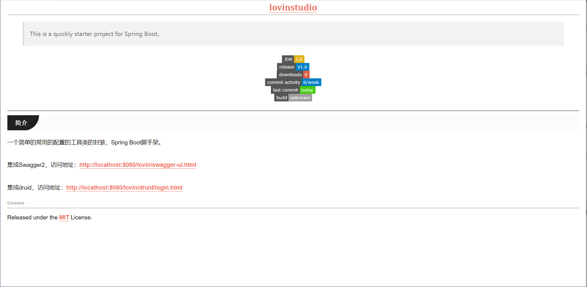
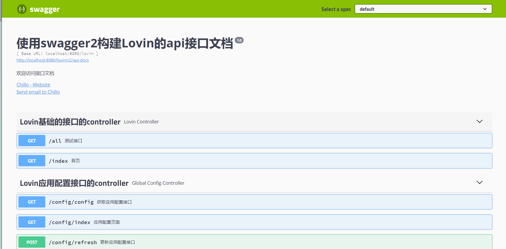
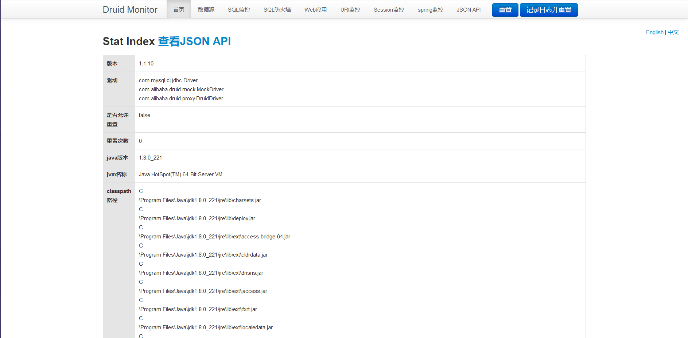
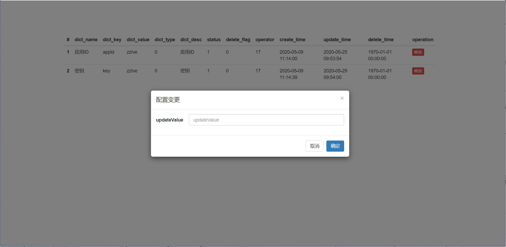

<h1 align="center"><a href="https://github.com/lovinstudio" target="_blank">lovinstudio</a></h1>

> This is a quickly starter project for Spring Boot。

<p align="center">
<a href="#"></a>
<a href="https://github.com/lovinstudio/lovinstarter/releases"></a>
<a href="https://github.com/lovinstudio/lovinstarter/releases"></a>
<a href="https://github.com/lovinstudio/lovinstarter/commits"></a>
<a href="https://github.com/lovinstudio/lovinstarter/commits"></a>
<a href="https://travis-ci.org/lovinstudio/lovinstarter"></a>
</p>

------------------------------

## 简介

一个简单的常用的配置的工具类的封装，Spring Boot脚手架。

欢迎访问[首页](http://localhost:8080/lovin/)


集成Swagger2，访问地址：[http://localhost:8080/lovin/swagger-ui.html](http://localhost:8080/lovin/swagger-ui.html)


集成druid，访问地址：[http://localhost:8080/lovin/druid/login.html](http://localhost:8080/lovin/druid/login.html)


## 动态刷新配置

访问[http://localhost:8080/lovin/config/config](http://localhost:8080/lovin/config/config) 查看当前生效的配置，当需要更改某些配置的时候，在数据库修改配置，然后访问[http://localhost:8080/lovin/config/index](http://localhost:8080/lovin/config/index) 打开配置页面，刷新配置即可加载最新的配置。


下面给出表结构

```sql
/*
 Navicat Premium Data Transfer

 Source Server         : localhost
 Source Server Type    : MySQL
 Source Server Version : 50721
 Source Host           : localhost:3306
 Source Schema         : training

 Target Server Type    : MySQL
 Target Server Version : 50721
 File Encoding         : 65001

 Date: 22/05/2020 22:59:24
*/

SET NAMES utf8mb4;
SET FOREIGN_KEY_CHECKS = 0;

-- ----------------------------
-- Table structure for system_dict
-- ----------------------------
DROP TABLE IF EXISTS `system_dict`;
CREATE TABLE `system_dict`  (
  `id` int(11) NOT NULL AUTO_INCREMENT COMMENT '自增主键，唯一标识',
  `dict_name` varchar(64) CHARACTER SET utf8 COLLATE utf8_general_ci NOT NULL COMMENT '字典名称',
  `dict_key` varchar(255) CHARACTER SET utf8 COLLATE utf8_general_ci NOT NULL COMMENT '字典KEY',
  `dict_value` varchar(2000) CHARACTER SET utf8 COLLATE utf8_general_ci NOT NULL COMMENT '字典VALUE',
  `dict_type` int(11) NOT NULL DEFAULT 0 COMMENT '字典类型 0系统配置 1用户配置',
  `dict_desc` varchar(255) CHARACTER SET utf8 COLLATE utf8_general_ci NOT NULL DEFAULT '' COMMENT '字典描述',
  `status` int(4) NOT NULL DEFAULT 1 COMMENT '字典状态：0-停用 1-正常',
  `delete_flag` tinyint(1) NOT NULL DEFAULT 0 COMMENT '是否删除：0-未删除 1-已删除',
  `operator` int(11) NOT NULL COMMENT '操作人ID，关联用户域用户表ID',
  `create_time` datetime(0) NOT NULL DEFAULT CURRENT_TIMESTAMP COMMENT '创建时间',
  `update_time` datetime(0) NOT NULL DEFAULT CURRENT_TIMESTAMP COMMENT '修改时间',
  `delete_time` datetime(0) NOT NULL DEFAULT '1970-01-01 00:00:00' COMMENT '删除时间',
  PRIMARY KEY (`id`) USING BTREE
) ENGINE = InnoDB AUTO_INCREMENT = 3 CHARACTER SET = utf8 COLLATE = utf8_general_ci COMMENT = '配置字典表' ROW_FORMAT = Dynamic;

-- ----------------------------
-- Records of system_dict
-- ----------------------------
INSERT INTO `system_dict` VALUES (1, '应用ID', 'appid', 'eelve', 0, '应用ID', 1, 0, 17, '2020-05-09 11:14:00', '2020-05-09 11:14:00', '1970-01-01 00:00:00');
INSERT INTO `system_dict` VALUES (2, '密钥', 'key', 'eelve', 0, '密钥', 1, 0, 17, '2020-05-09 11:14:39', '2020-05-09 11:14:39', '1970-01-01 00:00:00');

SET FOREIGN_KEY_CHECKS = 1;

```

# License
Released under the [MIT](LICENSE) License.
